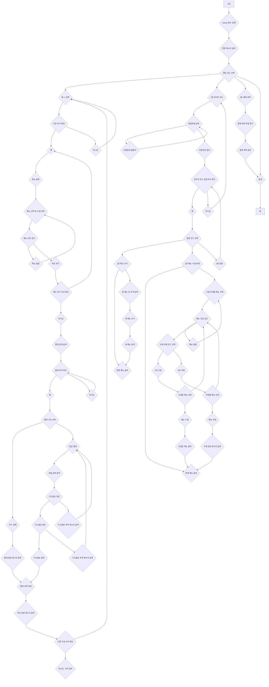

## 무인 POS 시스템 개발 프로젝트

**1. 프로젝트 개요**

포스트 코로나 시대에 증가하는 무인 서비스 수요를 충족하기 위해 무인 POS(Point of Sale) 시스템을 개발하는 프로젝트입니다. 사용자 친화적인 인터페이스와 효율적인 코드 구조를 통해 안정적이고 편리한 무인 결제 환경을 제공하는 것을 목표로 합니다.

**2. 주요 기능**

* **관리자 모드:** 
    * 메뉴 및 가격 추가, 수정, 삭제 기능
    * 비밀번호를 통한 접근 제어로 보안 강화
* **메뉴 주문 모드:** 
    * 직관적인 메뉴 선택 및 수량 입력
    * 테이블 번호 입력을 통한 주문 관리
* **결제 모드:** 
    * 테이블 번호 기반 주문 내역 조회
    * 카드 및 현금 결제 지원
    * 정확한 잔돈 계산 및 거스름돈 안내
* **결제 내역 저장:** 
    * 일일 결제 내역을 텍스트 파일("today_order.txt")에 저장하여 체계적인 관리 지원

**3. 사용된 기술 및 도구**

* **Python:** 간결하고 가독성 높은 문법을 통해 빠른 개발 및 유지 보수 용이
* **딕셔너리, 리스트:** 메뉴 정보, 주문 내역 등 데이터 구조화 및 효율적인 관리
* **파일 입출력:** 결제 내역 저장 및 조회 기능 구현

**4. 구현된 함수**

* `main()`: 프로그램 시작, 사용자 모드 선택 및 종료 기능 제공
* `Order_mode()`: 주문 및 결제 프로세스 처리 (메뉴 선택, 수량 입력, 결제 방식 선택, 결제 내역 저장 등)
* `manager_mode()`: 관리자 모드 접근 및 메뉴 관리 기능 제공 (메뉴 추가, 수정, 삭제)
* `orderlist()`: 저장된 결제 내역 파일 읽기 및 출력 기능

**5. 회고**

* **유익했던 점:** 이론으로 배운 Python 기능들을 실제 프로젝트에 적용하며 실력 향상 및 문제 해결 능력 배양
* **아쉬웠던 점:** 복잡한 로직 구현 및 예외 처리 부분에서 어려움을 겪었으며, 코드 개선의 여지가 있음

**앞으로 더욱 깊이 있는 학습과 다양한 프로젝트 경험을 통해 개발 역량을 강화하고, 사용자 친화적이고 효율적인 프로그램을 개발할 수 있도록 노력하겠습니다.** 

**7. 순서도**

---

**참고:** 이 README는 프로젝트의 핵심 내용을 요약한 것으로, 자세한 구현 내용은 소스 코드를 참고해주세요.
